# Access Control Changes - Visual Explanation

## Overview

This document uses Mermaid diagrams to explain all the changes made to implement domain-based access control for Comply Vault.

## 1. Domain-Based Routing Architecture

### Before
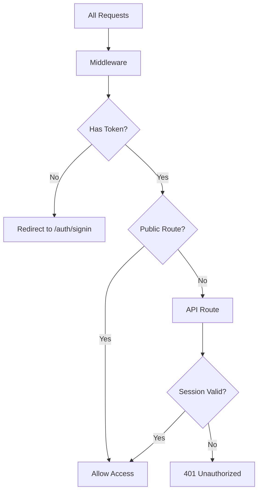

### After
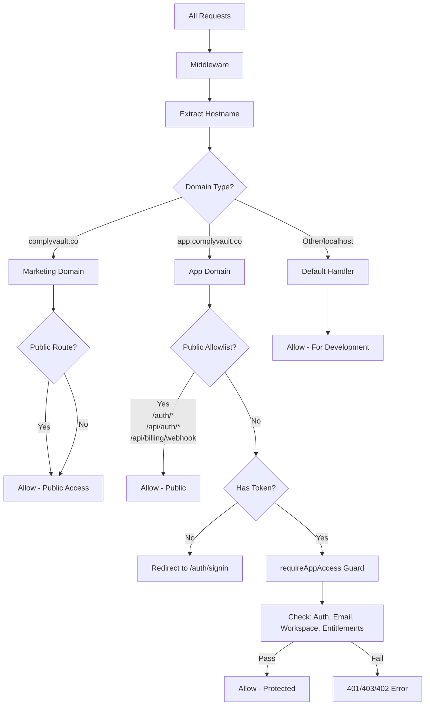

## 2. Access Guard Flow

### requireAppAccess() Guard Function

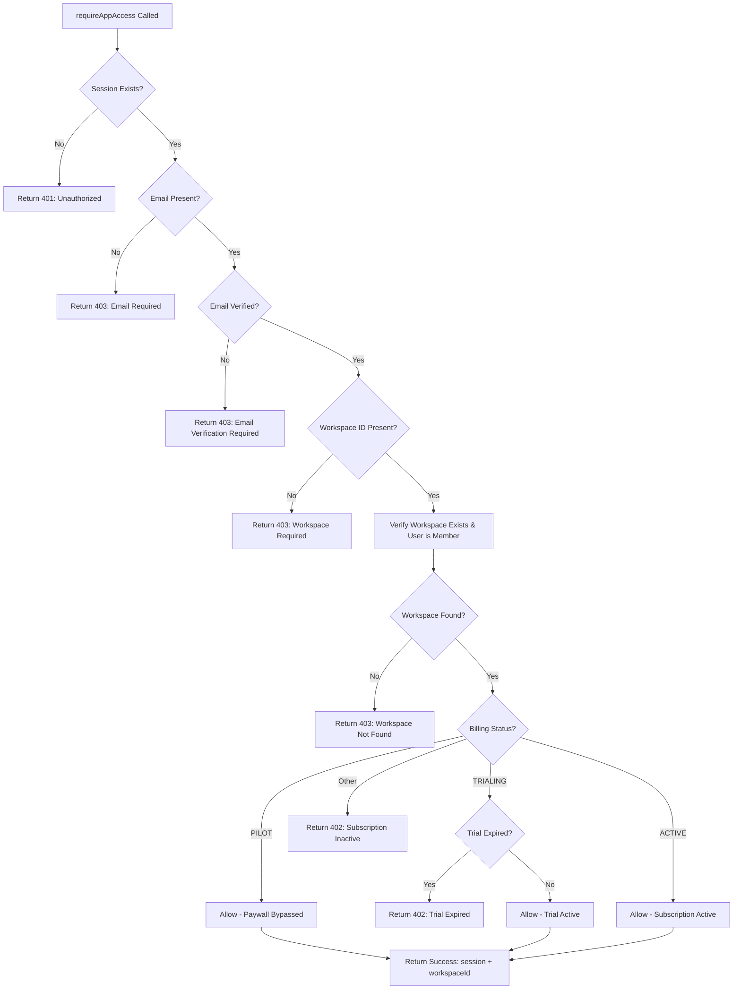

## 3. Trial Request Flow (Marketing Domain)

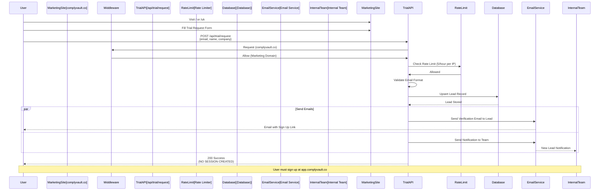

## 4. Protected API Route Flow (App Domain)

### Before
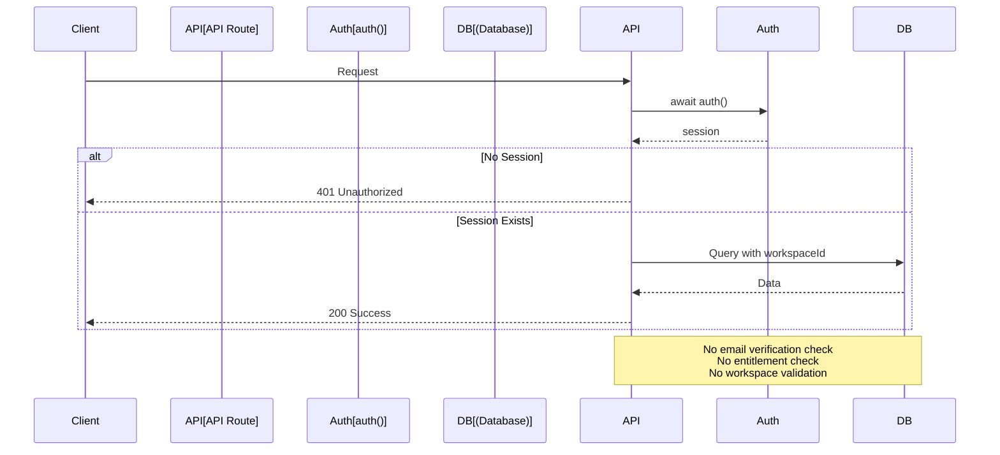

### After
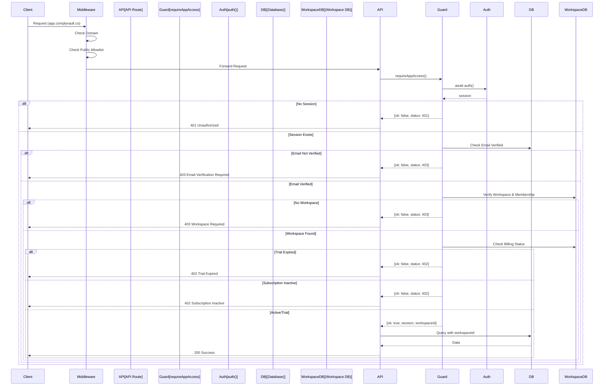

## 5. File Changes Overview

```mermaid
graph TB
    Changes[Access Control Changes] --> Created[Created Files]
    Changes --> Modified[Modified Files]
    Changes --> Schema[Schema Changes]
    
    Created --> Guards[src/server/auth/guards.ts<br/>requireAppAccess<br/>requireAuthAndEmailVerified]
    Created --> TrialAPI[src/app/api/trial/request/route.ts<br/>Public Trial Endpoint]
    Created --> Docs[ACCESS_CONTROL_IMPLEMENTATION.md<br/>ACCESS_CONTROL_CHANGES.md]
    
    Modified --> Middleware[src/middleware.ts<br/>Domain Detection & Routing]
    Modified --> Layout[src/app/app/layout.tsx<br/>Server-Side Protection]
    Modified --> UploadInit[src/app/api/upload/init/route.ts]
    Modified --> UploadComplete[src/app/api/upload/complete/route.ts]
    Modified --> MeetingEdit[src/app/api/meetings/id/edit/route.ts]
    Modified --> MeetingFinalize[src/app/api/meetings/id/finalize/route.ts]
    Modified --> Search[src/app/api/search/route.ts]
    
    Schema --> LeadModel[prisma/schema.prisma<br/>Added Lead Model]
    
    style Guards fill:#90EE90
    style TrialAPI fill:#90EE90
    style Middleware fill:#FFD700
    style Layout fill:#FFD700
```

## 6. Security Enforcement Layers

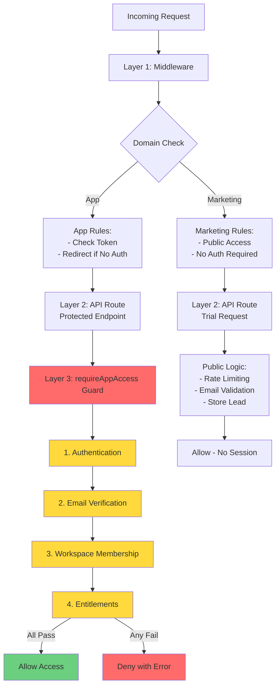

## 7. Request Flow Comparison

### Marketing Domain Request
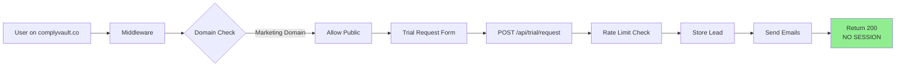

### App Domain Request (Protected)
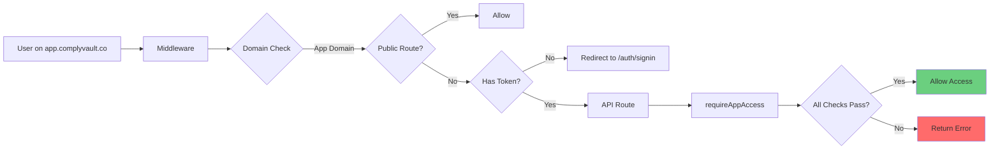

## 8. Database Schema Changes

```mermaid
erDiagram
    User ||--o{ UserWorkspace : has
    User ||--o{ Account : authenticates
    User {
        string id PK
        string email
        datetime emailVerified
        string name
    }
    
    Workspace ||--o{ UserWorkspace : has
    Workspace ||--o{ Meeting : contains
    Workspace {
        string id PK
        string name
        enum billingStatus
        enum planTier
        datetime trialEndsAt
    }
    
    Lead {
        string id PK
        string email UK
        string name
        string company
        string source
        string ipAddress
        datetime createdAt
    }
    
    UserWorkspace {
        string userId FK
        string workspaceId FK
        enum role
    }
    
    Note1[New Model] Lead
    Note2[Existing Models] User, Workspace, UserWorkspace
```

## 9. API Route Update Pattern

### Before (Example: /api/upload/init)
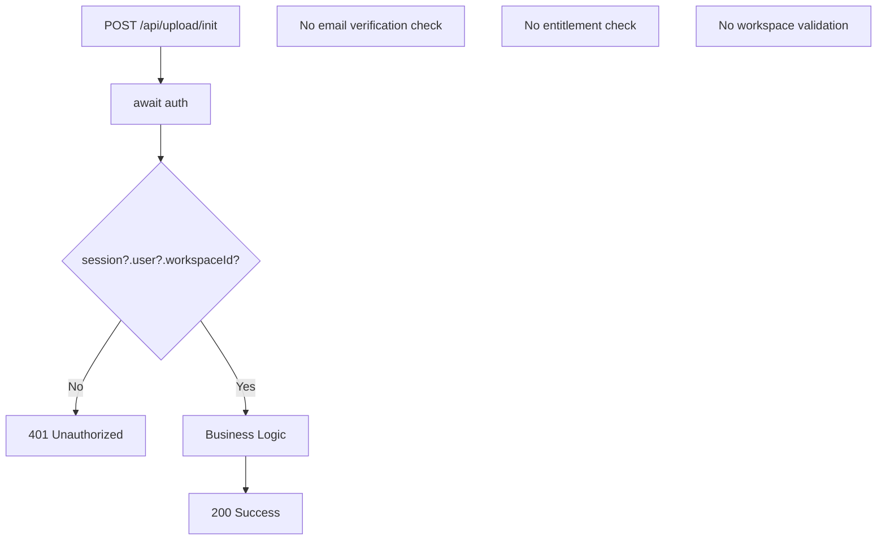

### After (Example: /api/upload/init)
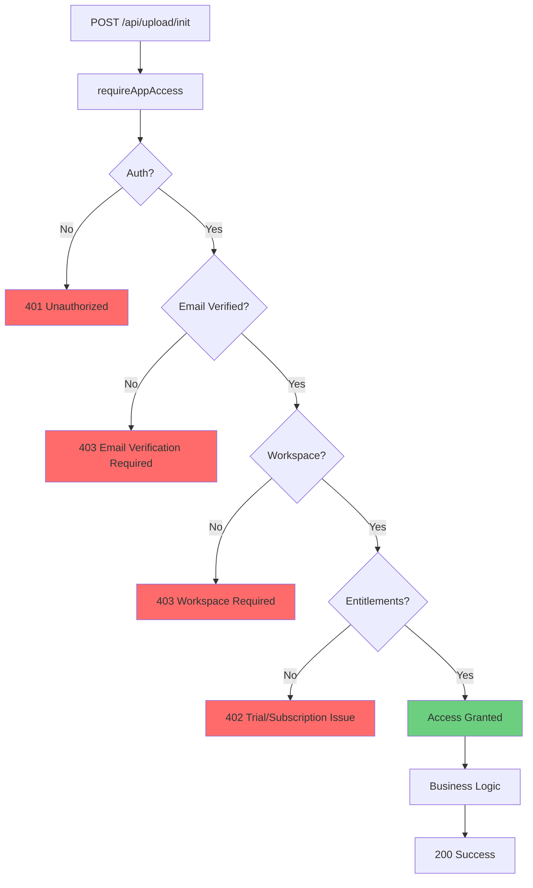

## 10. Complete Request Lifecycle

```mermaid
stateDiagram-v2
    [*] --> RequestReceived: HTTP Request
    
    RequestReceived --> DomainDetection: Extract Hostname
    
    DomainDetection --> MarketingDomain: complyvault.co
    DomainDetection --> AppDomain: app.complyvault.co
    DomainDetection --> Default: Other/localhost
    
    MarketingDomain --> MarketingPublic: Check Public Route
    MarketingPublic --> TrialRequest: /api/trial/request
    MarketingPublic --> MarketingPage: Other Pages
    TrialRequest --> RateLimit: Check Rate Limit
    RateLimit --> StoreLead: Store in Database
    StoreLead --> SendEmails: Send Notifications
    SendEmails --> ReturnSuccess: 200 (No Session)
    MarketingPage --> ReturnSuccess
    
    AppDomain --> AppPublic: Check Allowlist
    AppPublic --> PublicAllowed: /auth/*, /api/auth/*
    AppPublic --> ProtectedRoute: Other Routes
    
    ProtectedRoute --> CheckToken: Has Auth Token?
    CheckToken --> RedirectSignIn: No Token
    CheckToken --> RequireGuard: Has Token
    
    RequireGuard --> CheckAuth: Verify Session
    CheckAuth --> CheckEmail: Email Verified?
    CheckEmail --> CheckWorkspace: Workspace Member?
    CheckWorkspace --> CheckEntitlements: Trial/Paid Active?
    
    CheckEntitlements --> AllowAccess: All Checks Pass
    CheckEntitlements --> ReturnError: Any Check Fails
    
    PublicAllowed --> AllowAccess
    Default --> AllowAccess
    
    ReturnSuccess --> [*]
    ReturnError --> [*]
    RedirectSignIn --> [*]
    AllowAccess --> [*]
```

## Summary of Changes

### Core Changes
1. **Domain Detection**: Middleware now detects and routes based on hostname
2. **Access Guards**: New `requireAppAccess()` function enforces 4-layer security
3. **Trial Endpoint**: Public endpoint for marketing domain (no session creation)
4. **Lead Model**: Database schema for storing trial requests

### Security Improvements
- ✅ Email verification required
- ✅ Workspace membership validated
- ✅ Entitlements checked (trial/subscription)
- ✅ Domain-based routing prevents unauthorized access
- ✅ Rate limiting on public endpoints

### Files Changed
- **Created**: 3 new files (guards, trial API, docs)
- **Modified**: 8 files (middleware, layout, 5 API routes, schema)
- **Remaining**: ~20 API routes need guard updates
