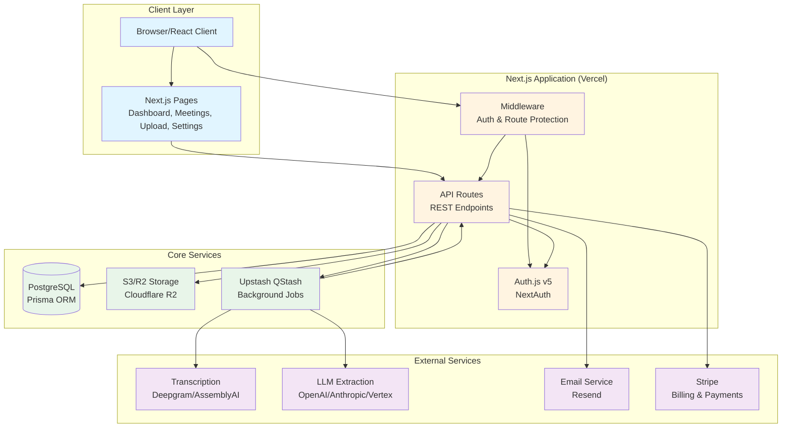
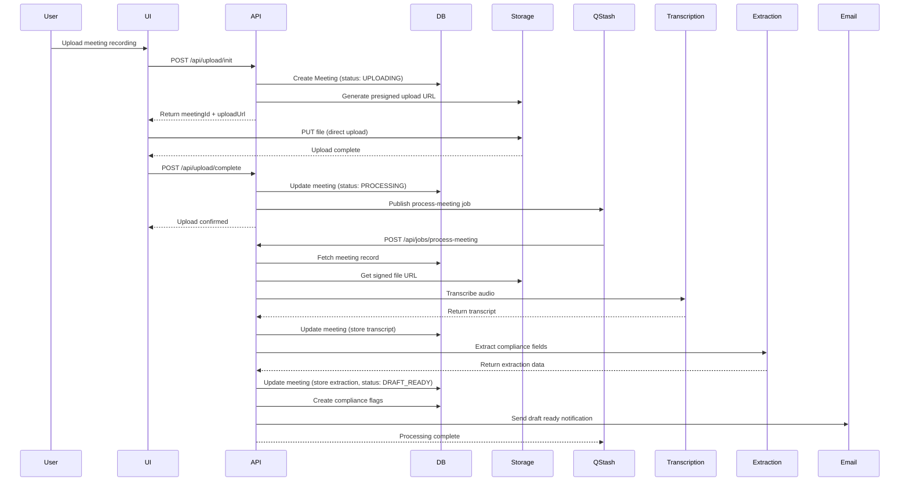
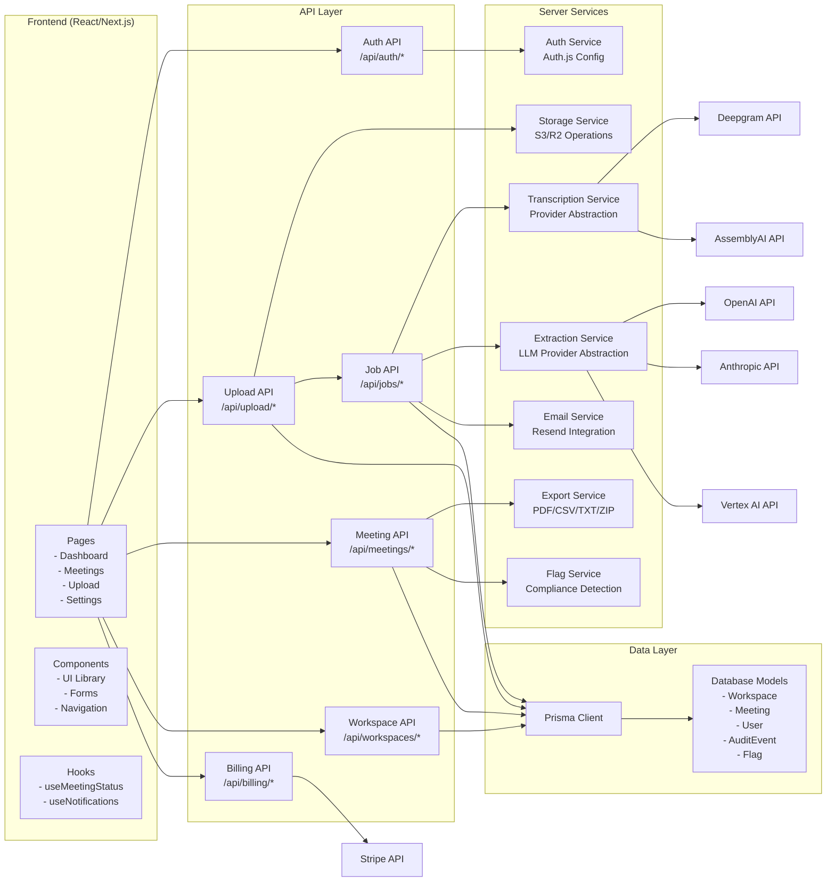
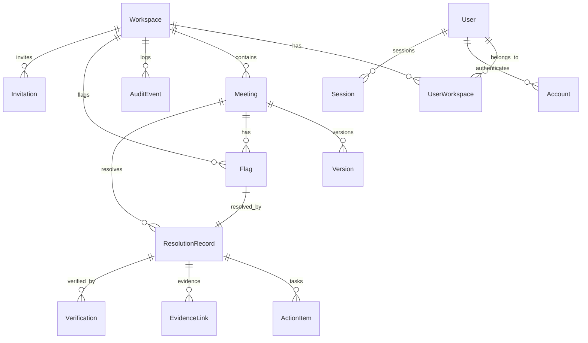
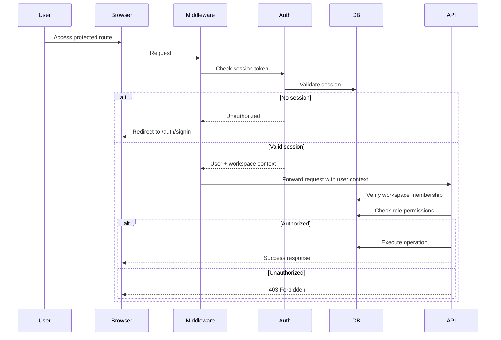
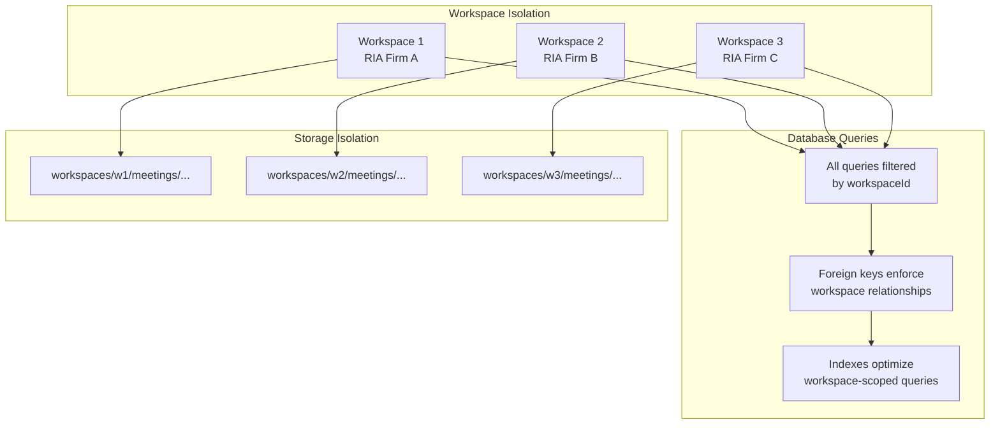
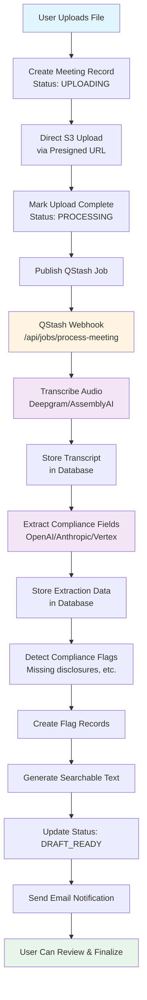

# Comply Vault Architecture

## System Architecture Diagram



## Data Flow: Meeting Upload & Processing



## Component Architecture



## Database Schema Overview



## Authentication & Authorization Flow



## Multi-Tenant Isolation



## Processing Pipeline



## Technology Stack

### Frontend
- **Framework**: Next.js 15 (App Router)
- **Language**: TypeScript
- **UI Library**: Radix UI + Tailwind CSS
- **State Management**: React Hooks + Server Components
- **Forms**: React Hook Form + Zod validation

### Backend
- **Runtime**: Next.js API Routes (Node.js)
- **ORM**: Prisma
- **Database**: PostgreSQL
- **Authentication**: Auth.js v5 (NextAuth)
- **Background Jobs**: Upstash QStash

### Storage & Infrastructure
- **File Storage**: S3-compatible (Cloudflare R2)
- **Hosting**: Vercel
- **Database Hosting**: Vercel Postgres / Neon

### External Services
- **Transcription**: Deepgram, AssemblyAI
- **LLM Extraction**: OpenAI, Anthropic, Google Vertex AI
- **Email**: Resend
- **Payments**: Stripe
- **Background Jobs**: Upstash QStash

## Key Architectural Patterns

### 1. Multi-Tenant Architecture
- **Workspace-based isolation**: All data scoped to workspace
- **Database-level enforcement**: Foreign keys ensure isolation
- **API-level validation**: All routes verify workspace membership
- **Storage isolation**: Files organized by workspace ID

### 2. Async Processing
- **QStash for background jobs**: Long-running tasks (transcription, extraction)
- **Webhook-based processing**: QStash calls API endpoint when ready
- **Status tracking**: Meeting status reflects processing state
- **Error handling**: Failed jobs can be retried

### 3. Direct File Upload
- **Presigned URLs**: Client uploads directly to S3/R2
- **Bypasses Vercel limits**: No 4.5MB function payload limit
- **Provenance tracking**: SHA-256 hashes for file integrity

### 4. Audit Trail
- **Append-only logs**: Immutable audit events
- **Comprehensive tracking**: All user actions logged
- **Workspace-scoped**: Audit logs isolated per workspace
- **Retention compliance**: Meets SEC 5-year requirement

### 5. Compliance Flags
- **Automated detection**: System flags compliance issues
- **Remediation workflow**: Track resolution of flags
- **Evidence linking**: Connect flags to transcript evidence
- **Verification process**: CCO can verify resolutions

## Security Architecture

### Authentication
- **OAuth providers**: Discord (primary), Google (optional)
- **Session management**: Secure HTTP-only cookies
- **Token-based**: JWT tokens for API authentication

### Authorization
- **Role-based access control**: OWNER_CCO vs MEMBER roles
- **Workspace membership**: Users belong to workspaces
- **Permission checks**: API routes verify role permissions

### Data Protection
- **Encryption in transit**: TLS 1.2+
- **Encryption at rest**: AES-256 for database and storage
- **Tenant isolation**: Strict workspace boundaries
- **Audit logging**: All actions tracked

## Deployment Architecture

```
┌─────────────────────────────────────────┐
│         Vercel Edge Network            │
│  (Global CDN + Edge Functions)          │
└─────────────────────────────────────────┘
                    │
        ┌───────────┴───────────┐
        │                       │
┌───────▼────────┐      ┌───────▼────────┐
│  Next.js App   │      │  API Routes    │
│  (SSR/SSG)     │      │  (Serverless)   │
└───────┬────────┘      └───────┬────────┘
        │                       │
        └───────────┬───────────┘
                    │
        ┌───────────▼───────────┐
        │   Vercel Postgres     │
        │   (Primary Database)   │
        └────────────────────────┘
                    │
        ┌───────────▼───────────┐
        │   Cloudflare R2        │
        │   (File Storage)        │
        └────────────────────────┘
                    │
        ┌───────────▼───────────┐
        │   Upstash QStash      │
        │   (Job Queue)          │
        └────────────────────────┘
```

## API Endpoints Overview

### Authentication
- `POST /api/auth/signin` - Sign in
- `POST /api/auth/signup` - Sign up
- `GET /api/auth/[...nextauth]` - NextAuth handlers

### Workspaces
- `POST /api/workspaces` - Create workspace
- `GET /api/workspaces` - List workspaces
- `PATCH /api/workspaces/[id]/settings` - Update settings

### Upload
- `POST /api/upload/init` - Initialize upload (get presigned URL)
- `POST /api/upload/complete` - Complete upload
- `POST /api/upload/transcript` - Upload transcript only

### Meetings
- `GET /api/meetings` - List meetings
- `GET /api/meetings/[id]` - Get meeting details
- `PATCH /api/meetings/[id]/edit` - Edit meeting
- `POST /api/meetings/[id]/finalize` - Finalize meeting
- `POST /api/meetings/[id]/export` - Export audit pack
- `POST /api/meetings/[id]/reprocess` - Reprocess meeting

### Background Jobs
- `POST /api/jobs/process-meeting` - Process meeting (QStash webhook)

### Billing
- `POST /api/billing/checkout` - Create Stripe checkout
- `POST /api/billing/webhook` - Stripe webhook handler
- `GET /api/billing/status` - Get billing status

### Compliance
- `GET /api/flags` - List flags
- `POST /api/flags/[id]/remediation` - Resolve flag

### Audit
- `GET /api/audit-logs` - List audit logs
- `GET /api/audit-logs/export` - Export audit logs

## Data Models

### Core Entities
- **Workspace**: Multi-tenant container
- **User**: Application user
- **UserWorkspace**: Many-to-many relationship (with role)
- **Meeting**: Client interaction record
- **Version**: Edit history for meetings
- **Flag**: Compliance issue
- **ResolutionRecord**: Flag resolution workflow
- **AuditEvent**: Immutable audit log

### Relationships
- Workspace → Meetings (1:N)
- Workspace → Users (N:M via UserWorkspace)
- Meeting → Versions (1:N)
- Meeting → Flags (1:N)
- Flag → ResolutionRecord (1:1)
- ResolutionRecord → ActionItems (1:N)
- ResolutionRecord → EvidenceLinks (1:N)

## Performance Considerations

### Database
- **Indexes**: Optimized for workspace-scoped queries
- **Connection pooling**: Managed by Vercel Postgres
- **Query optimization**: Prisma query optimization

### Storage
- **Presigned URLs**: Direct client-to-storage uploads
- **CDN**: Cloudflare R2 with global CDN
- **Compression**: ZIP exports use maximum compression

### Background Processing
- **Async jobs**: Long-running tasks offloaded to QStash
- **Retry logic**: Failed jobs automatically retried
- **Status tracking**: Real-time status updates

## Monitoring & Observability

### Logging
- **Console logs**: Structured logging for debugging
- **Error tracking**: Error responses with context
- **Audit logs**: All user actions logged to database

### Metrics
- `GET /api/metrics` - Application metrics endpoint
- Processing times tracked
- Error rates monitored

## Future Architecture Considerations

### Scalability
- **Horizontal scaling**: Stateless API routes
- **Database scaling**: Read replicas for reporting
- **Storage scaling**: S3-compatible storage scales automatically

### Extensibility
- **Provider abstraction**: Transcription and extraction providers are swappable
- **Flag system**: New compliance rules can be added
- **Export formats**: Additional formats can be added

### Compliance
- **Multi-jurisdiction**: Architecture supports SEC/FCA (see UK_US_MARKET_READINESS.md)
- **Retention policies**: Configurable per workspace
- **Legal hold**: Prevents deletion when active
