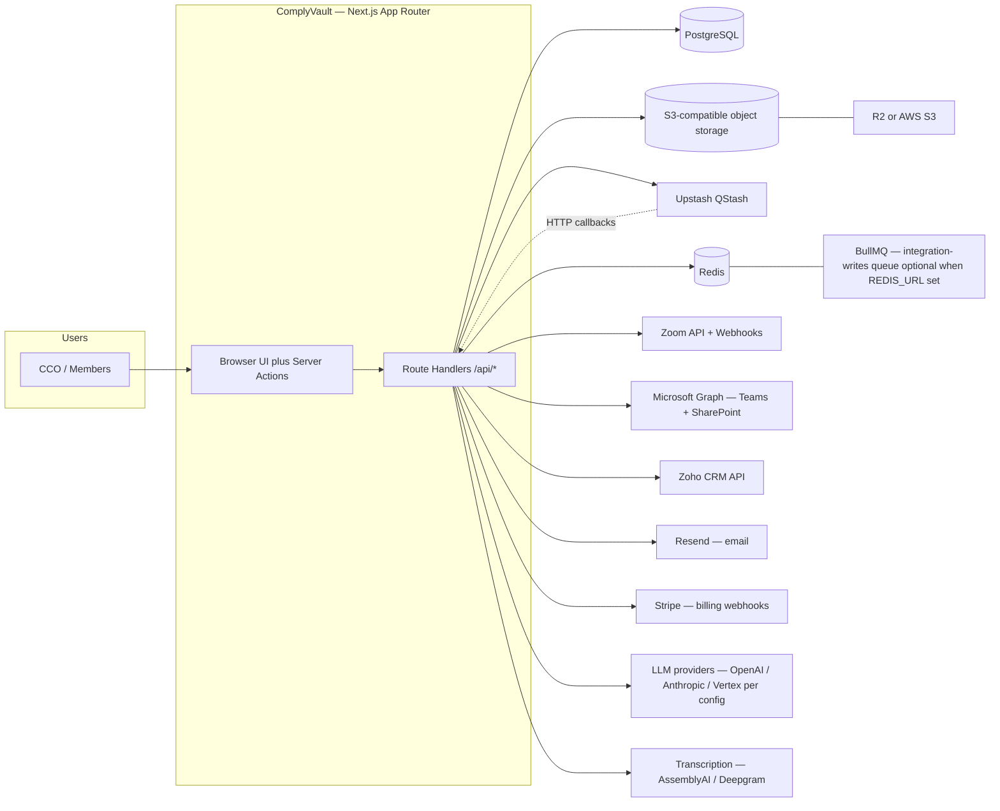
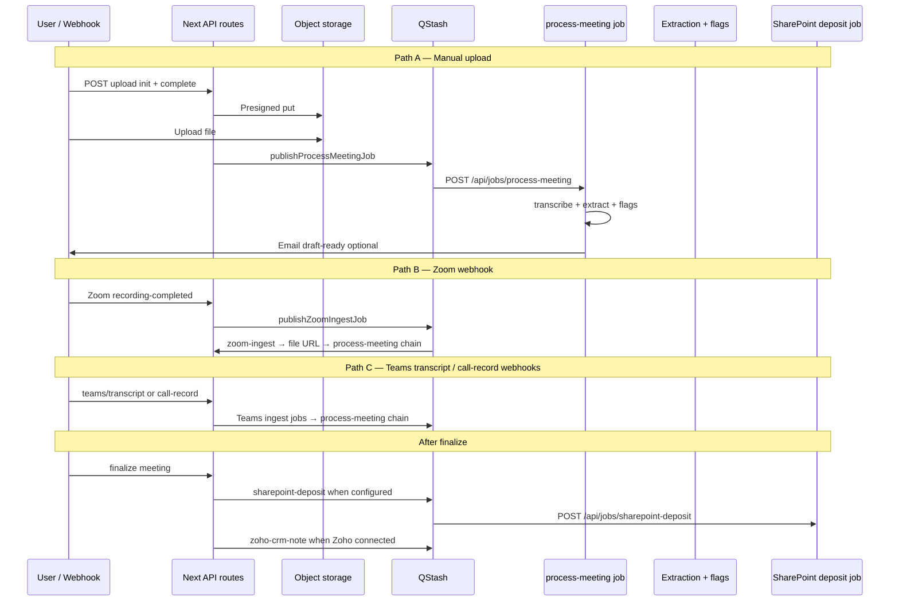
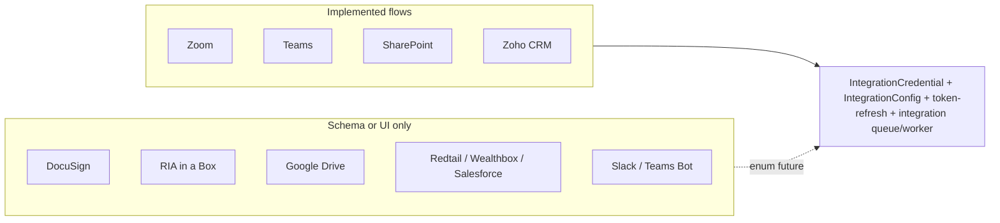
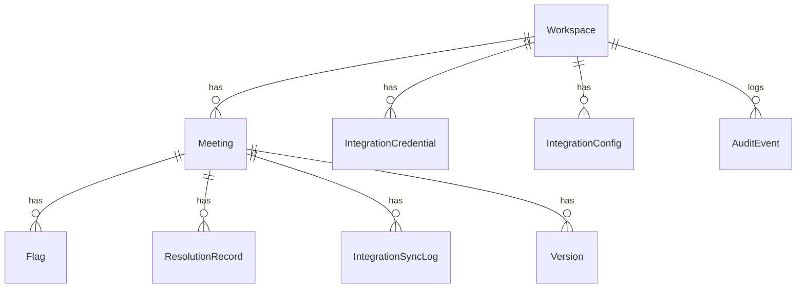

# ComplyVault — Architecture (As-Built from Codebase)

Living reference derived from `src/`, `prisma/schema.prisma`, and `app/api` routes. **Forward-looking PRD targets** (DocuSign envelopes, RIAB writes, Redtail, etc.) exist as `IntegrationProvider` enum or UI labels but **do not have full adapter + job flows** unless noted below.

---

## 1. System context

What the deployed app talks to today (when env vars are configured).

---

## 2. Application shape (logical layers)

```mermaid
flowchart TB
  subgraph presentation [Presentation — src/app]
    PAGES["(app) routes: dashboard, meetings, integrations, settings, upload, internal/ops"]
    AUTH["auth: NextAuth"]
    TEAMS_UI["Teams manifest + sidepanel pages"]
  end

  subgraph api [HTTP API — src/app/api]
    WH["webhooks/v1: zoom/recording-completed, teams/transcript, teams/call-record"]
    OAUTH["integrations: zoom, teams, sharepoint, zoho-crm — connect + callback"]
    JOBS["jobs: process-meeting, zoom-ingest, teams-ingest, teams-ingest-call-record, sharepoint-deposit, zoho-crm-note, process-integration-queue, integration-token-refresh"]
    CRON["cron: weekly-digest"]
    REST["upload, meetings CRUD, finalize, export, flags, workspaces, invitations, billing, trial, audit-logs, search, metrics, notifications"]
  end

  subgraph server [Server domain — src/server]
    INT["integrations: BaseIntegrationAdapter, adapters zoom/teams/sharepoint/zoho-crm, token-refresh, BullMQ queue plus worker when Redis configured, webhooks verify"]
    EXP["export: PDF/CSV/TXT audit pack"]
    EXT["extraction + flags"]
    TRN["transcription"]
    STG["storage — presigned S3"]
    EM["email — Resend"]
    QSH["qstash — publish helpers"]
    AUTHCFG["auth + billing guards"]
  end

  presentation --> api
  api --> server
  server --> PG[(Prisma → PostgreSQL)]
  server --> OBJ[(S3)]
```

---

## 3. Meeting lifecycle (core vertical slice)

---

## 4. Integrations — implementation status

| Provider        | OAuth / connect routes | Adapter module            | Async jobs / webhooks |
|----------------|------------------------|---------------------------|------------------------|
| Zoom           | Yes                    | `adapters/zoom.ts`        | Webhook + `zoom-ingest` |
| Teams          | Yes                    | `adapters/teams.ts`       | Webhooks + ingest jobs |
| SharePoint     | Yes                    | `adapters/sharepoint.ts`  | `sharepoint-deposit` after finalize |
| Zoho CRM       | Yes                    | `adapters/zoho-crm.ts`    | `zoho-crm-note`, contact field on meeting |
| DocuSign       | No full flow           | —                         | `verifyDocuSignConnect` helper only |
| RIAB / others  | UI / enum              | —                         | Token refresh stub paths |

---

## 5. Data persistence (high level)

---

## 6. Related docs

- Target / future-state sketches: [architecture-diagrams.md](./architecture-diagrams.md)
- Product scope (not implementation status): [prd-summary.md](./prd-summary.md)
