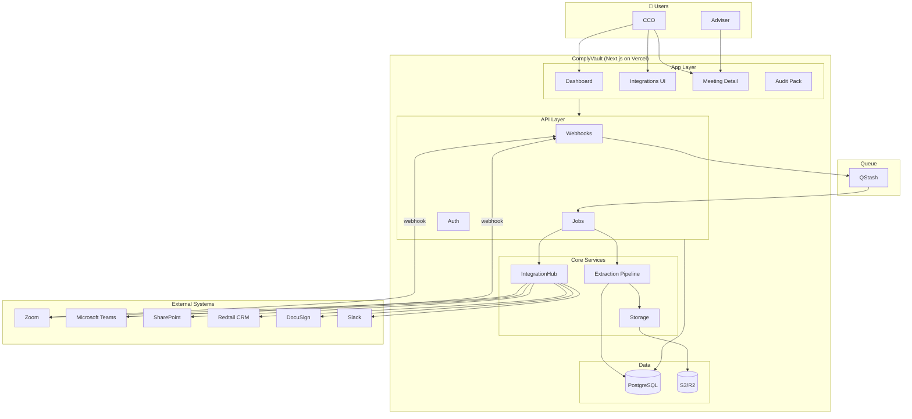
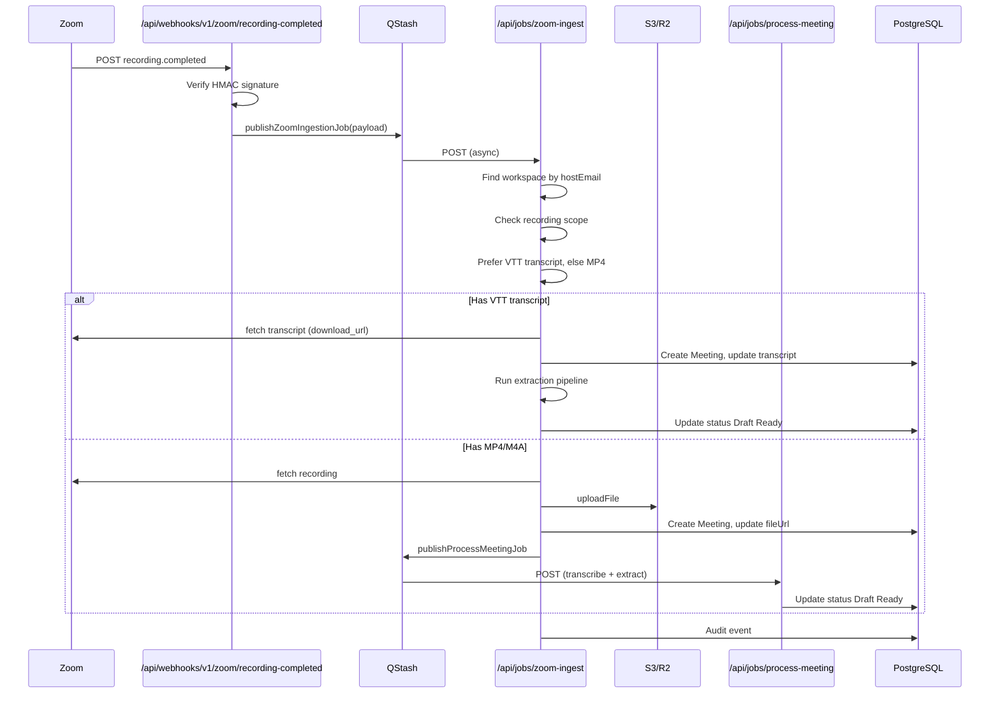
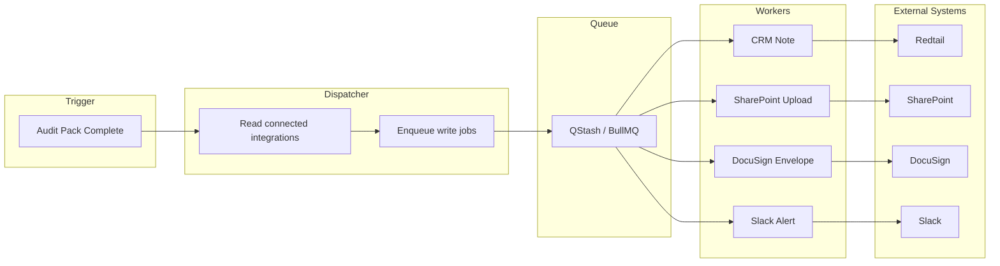
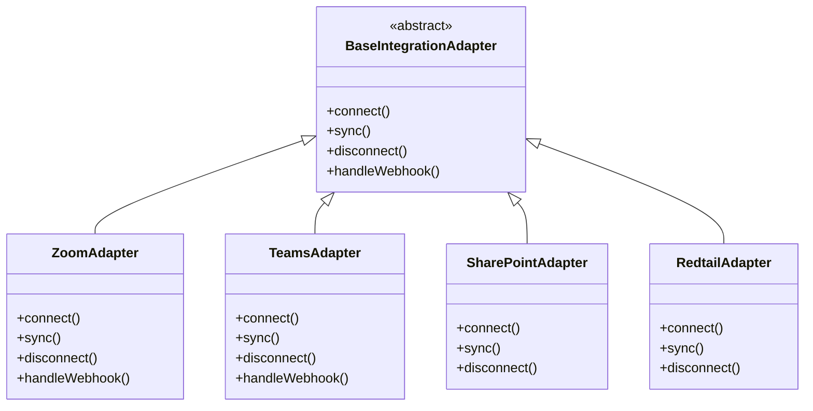
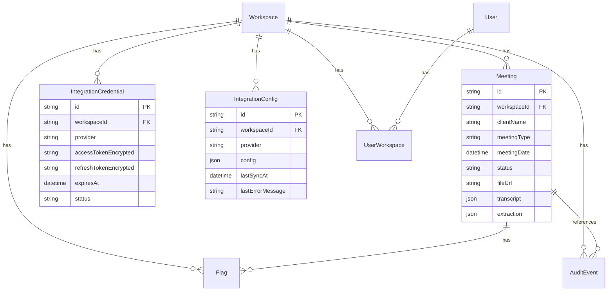
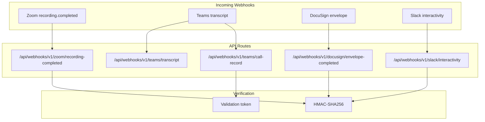
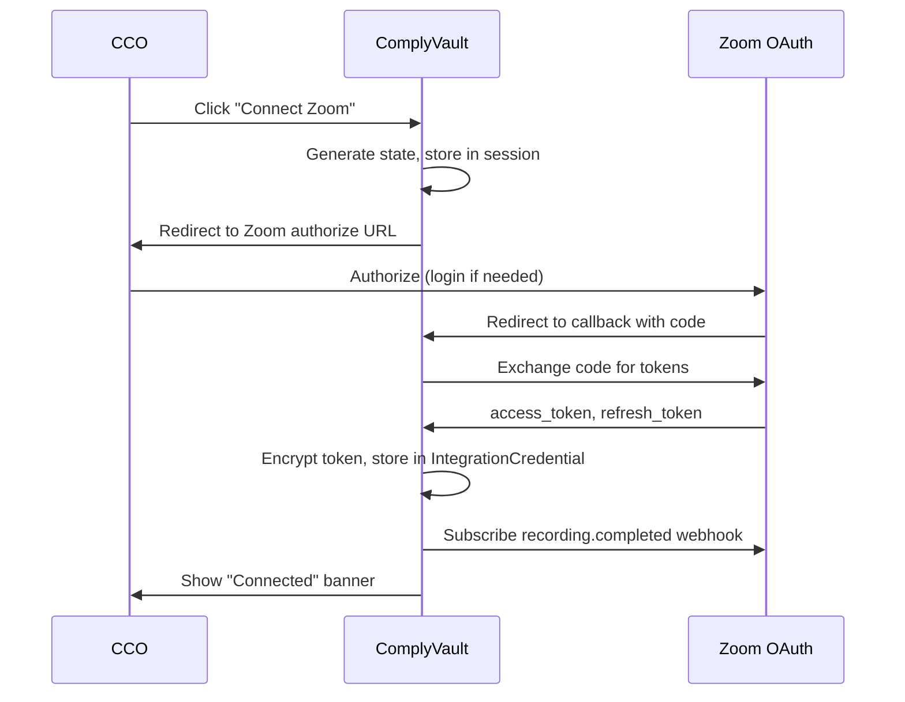
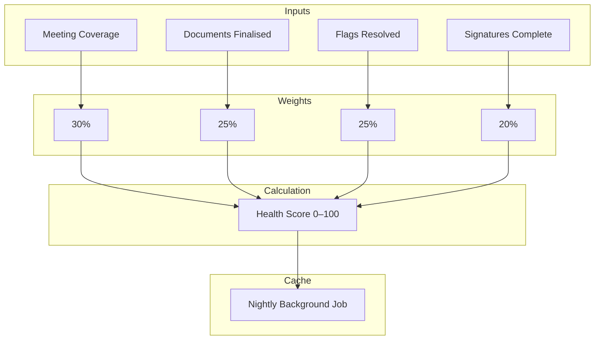
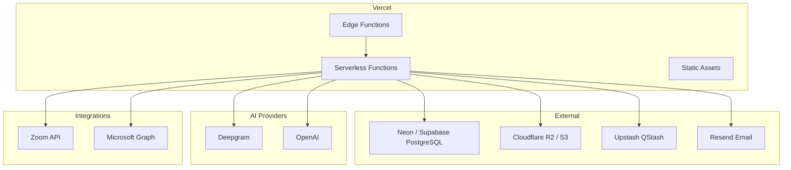

---
tags:
  - architecture
---

# ComplyVault — Architecture Diagrams

> Mermaid diagrams for system architecture, data flow, and integration patterns.  
> Render in GitHub, VS Code (Mermaid extension), or [mermaid.live](https://mermaid.live).

---

## 1. High-Level System Architecture

---

## 2. Meeting Ingestion Flow (Zoom)

---

## 3. Integration Data Flow

---

## 4. IntegrationHub Adapter Pattern

---

## 5. Data Model (Core Entities)

---

## 6. Webhook Endpoints

---

## 7. OAuth Flow (Zoom)

---

## 8. Compliance Health Score Calculation

---

## 9. Deployment Architecture (Vercel)

