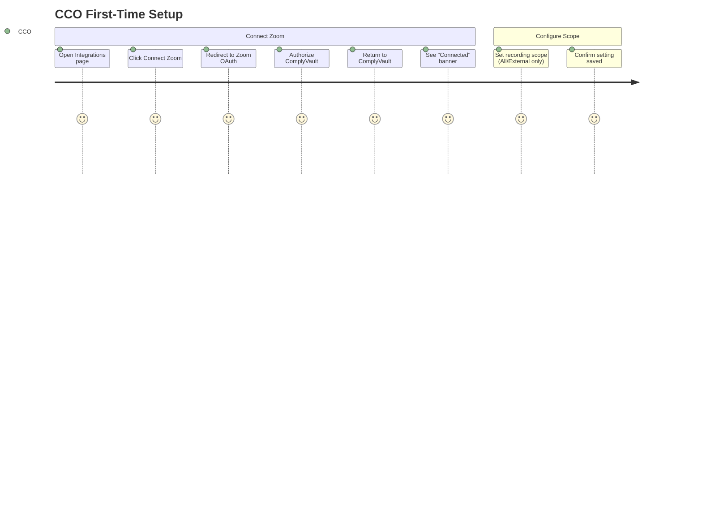
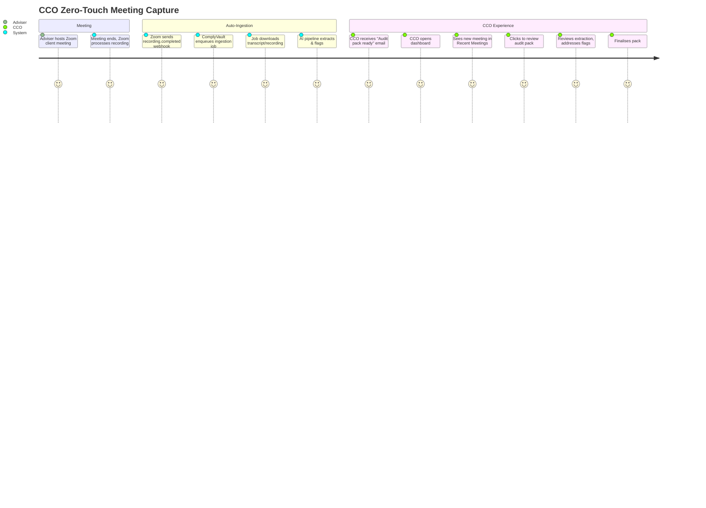
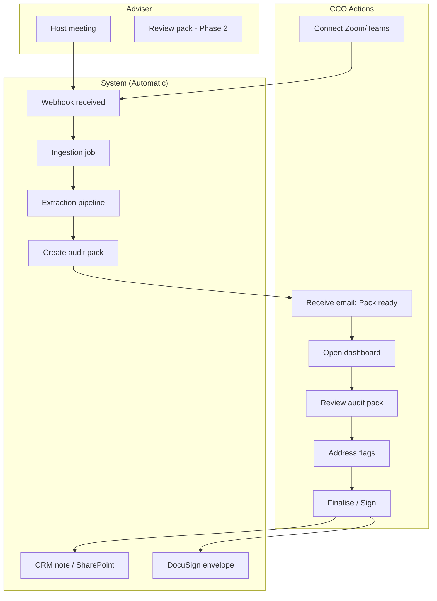
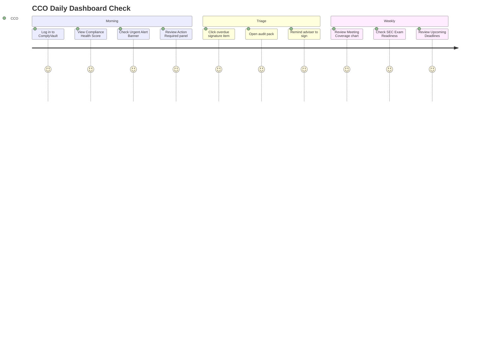
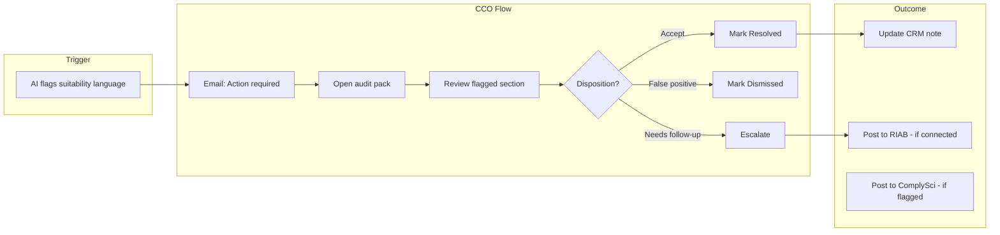
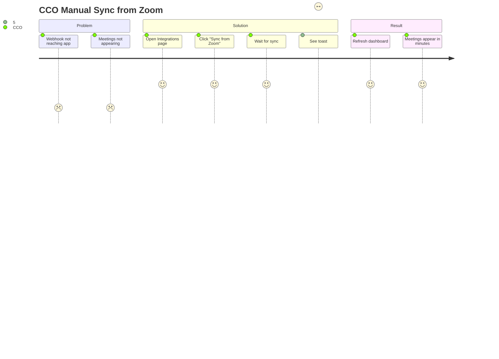
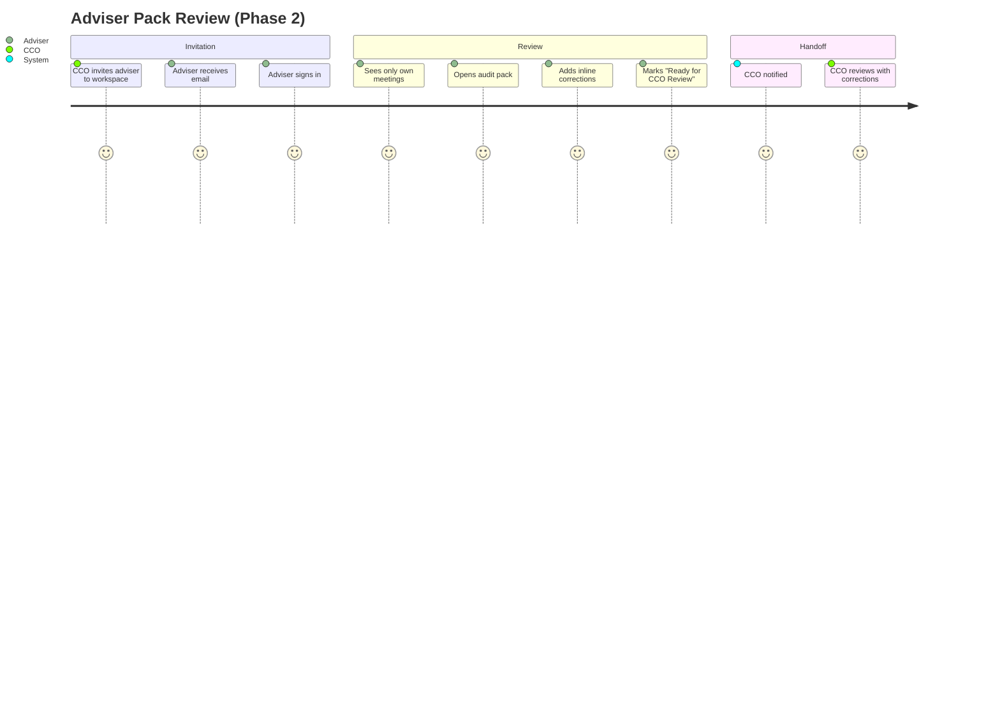
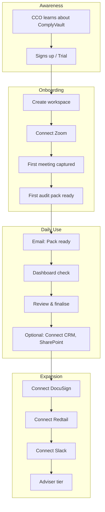
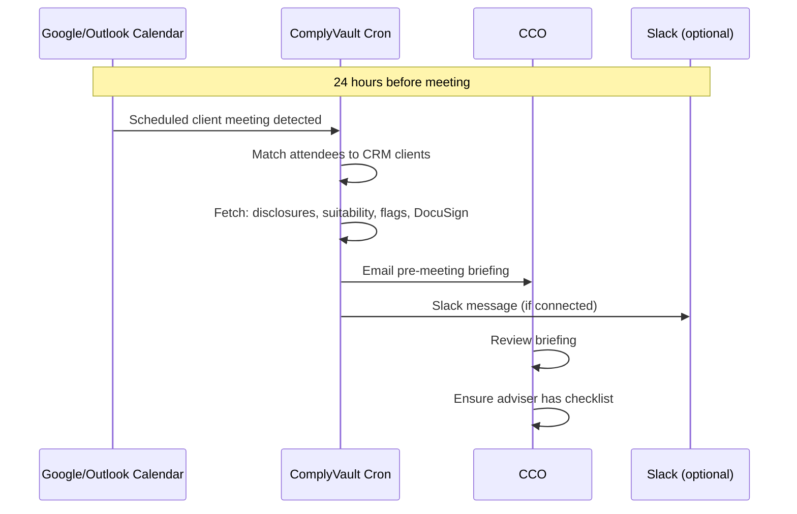

# ComplyVault — User Journeys

> User journey maps and flow diagrams for CCO and Adviser personas.

---

## 1. CCO — First-Time Setup (Integration Connection)

---

## 2. CCO — Zero-Touch Meeting Capture (Happy Path)

---

## 3. CCO — End-to-End Flow (Swimlane)

---

## 4. CCO — Dashboard Daily Check

---

## 5. CCO — Flagged Meeting Review

---

## 6. CCO — Manual Sync (Zoom)

---

## 7. Adviser — Pack Review (Phase 2 — Epic 8.4)

---

## 8. User Journey Map (Experience Layers)

---

## 9. CCO — Pre-Meeting Briefing (Phase 2 — Epic 8.1)

---

## 10. Touchpoint Summary

| Touchpoint | Channel | When |
|------------|---------|------|
| Integration connection | Web UI | One-time setup |
| Audit pack ready | Email | Per meeting |
| Action required | Email, Slack | When flags or overdue sigs |
| Weekly digest | Email | Monday 8AM |
| Dashboard | Web UI | Daily check |
| DocuSign | Email | When envelope sent |
| Pre-meeting briefing | Email, Slack | 24h before meeting (Phase 2) |
