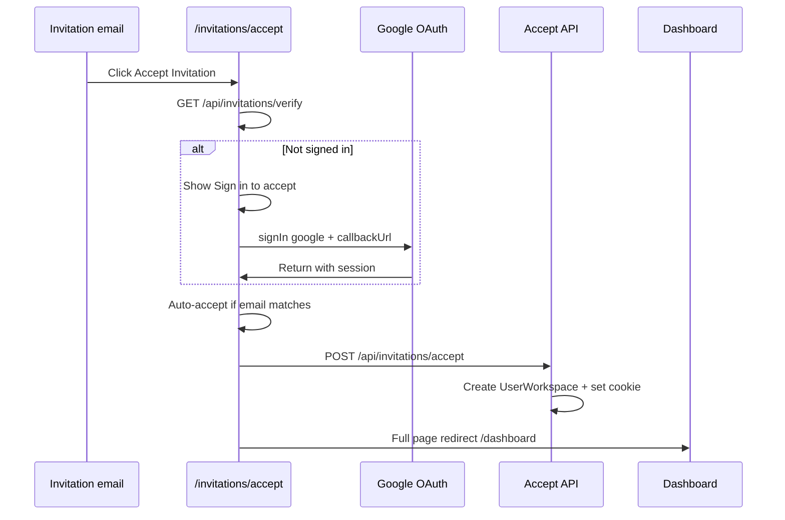
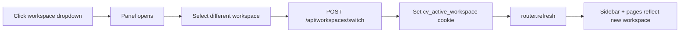

# Workspace Management & Invitation Workflow

> **Purpose:** As-built reference for workspace lifecycle, team invitations, and multi-workspace switching. Written for product, engineering, and **UX consultant review** — includes screen-level behavior, copy, states, and open design questions.
>
> **Last updated:** May 2026  
> **App domain:** `app.complyvault.co`  
> **Related:** [architecture-as-built.md](./architecture-as-built.md) · [user-journeys.md](./user-journeys.md) · [complyvault-dashboard-design-doc.md](./complyvault-dashboard-design-doc.md)

---

## 1. Overview

ComplyVault is **multi-tenant by workspace**. Each RIA firm operates in an isolated workspace containing meetings, flags, audit logs, and billing. Users can belong to one or more workspaces with a role per membership.

There are two primary onboarding paths:

| Path | Who | Entry | Outcome |
|------|-----|-------|---------|
| **Firm owner** | New customer / trial signup | Sign up → Create workspace | User becomes `OWNER_CCO` of a new workspace |
| **Team invitee** | Invited colleague | Email link → Accept invitation | User joins existing workspace with assigned role |

These paths must not be conflated. An invited user should **never** be asked to create a new trial workspace unless they intentionally start their own firm.

---

## 2. Core Concepts

### 2.1 Workspace

A workspace represents one RIA firm’s compliance environment.

- **Created by:** Authenticated user via `/workspaces/new`
- **Creator role:** `OWNER_CCO` (automatic)
- **Billing:** Attached per workspace (trial, solo, team tiers)
- **Settings:** Retention years (5–10), legal hold — `OWNER_CCO` only

### 2.2 Membership (`UserWorkspace`)

Links a user to a workspace with exactly one role. A user may hold memberships in multiple workspaces (e.g. consultant across firms).

### 2.3 Active workspace

When a user belongs to multiple workspaces, one workspace is **active** at a time. The active workspace drives:

- Sidebar context (name, client count, team list)
- Session `workspaceId` and `role`
- All app pages (dashboard, meetings, review queue, etc.)

**Persistence:** `cv_active_workspace` httpOnly cookie (30 days). Set when switching workspaces or accepting an invitation. Cleared on sign-out.

### 2.4 Invitation

A time-limited tokenized link sent by email. On accept, creates a `UserWorkspace` row and marks the invitation accepted. Does **not** create a new workspace.

| Property | Value |
|----------|-------|
| Token | 64-char hex (32 random bytes) |
| Expiry | 7 days from creation |
| Uniqueness | One pending invite per email per workspace |
| Resend | Reuses same token if pending and not expired |

---

## 3. Roles & Permissions

### 3.1 Role definitions

| Internal role | UI label | Primary responsibilities |
|---------------|----------|------------------------|
| `OWNER_CCO` | **CCO** / Owner/CCO | Finalize records, workspace settings, invite/remove members, integrations, audit logs |
| `MEMBER` | **Compliance Manager** | Triage flags, support review workflow |
| `ADVISOR` | **Advisor** | Certify meeting transcripts |

Role descriptions shown on the invite form:

> Advisors certify transcripts. Compliance Managers triage flags. Owners/CCOs sign off and finalize.

### 3.2 Permission matrix (workspace management)

| Action | OWNER_CCO | MEMBER | ADVISOR |
|--------|:---------:|:------:|:-------:|
| Create new workspace (trial) | ✓ | ✓* | ✓* |
| Invite team members | ✓ | ✗ | ✗ |
| Remove team members | ✓ | ✗ | ✗ |
| Edit retention / legal hold | ✓ | ✗ | ✗ |
| Switch workspace (if member) | ✓ | ✓ | ✓ |
| View team in sidebar dropdown | ✓ | ✓ | ✓ |
| Integrations nav item | ✓ | ✗ | ✗ |
| Audit Logs nav item | ✓ | ✗ | ✗ |

\*Any authenticated user without a workspace can create one; invited users should be routed to accept flow instead (see §6).

### 3.3 Billing seat limits

Pending non-expired invitations count toward seat limits:

| Plan | Max users (incl. pending invites) |
|------|-------------------------------------|
| Free / Solo / Trial | 1 |
| Team | 10 |

Invite API returns **402** when seat limit is reached.

### 3.4 UX inconsistency (for consultant review)

The sidebar footer shows only two labels:

- `Owner / CCO` for `OWNER_CCO`
- `Member` for **all other roles** (does not distinguish Advisor vs Compliance Manager)

The workspace dropdown team list **does** show the correct role label per person.

**Recommendation for UX review:** Align sidebar footer, user menu, and team list to use consistent role labels everywhere.

---

## 4. User Journeys

### 4.1 Firm owner — create workspace

```mermaid
flowchart TD
  A[Sign up / Sign in] --> B{Has workspace?}
  B -->|No| C[/workspaces/new]
  C --> D[Enter workspace name]
  D --> E[POST /api/workspaces]
  E --> F[Welcome email sent]
  F --> G[/welcome onboarding]
  G --> H[/dashboard]
  B -->|Yes| H
```

**UX notes:**

- Page title adapts to billing intent: “Create Your Free Trial Workspace” (default), Solo, or Team.
- Single required field: **Workspace Name** (max 100 chars).
- Helper text: “This will be your firm’s workspace name.”
- Primary CTA: “Create Free Trial Workspace” (or Solo/Team variant).
- Success: inline alert + redirect to `/welcome` after ~1.2s.
- Layout: centered card on app background; **full app chrome** (sidebar + top bar).

### 4.2 Owner/CCO — invite team member

```mermaid
flowchart TD
  A[Sidebar workspace dropdown] --> B[Invite team member]
  B --> C[/workspaces/:id/invite]
  C --> D{Single or Bulk tab}
  D --> E[Enter email + role]
  E --> F[POST invitations API]
  F --> G[Invitation email sent]
  G --> H[Success alert]
  H --> I[Redirect to dashboard after 2s]
```

**Entry points:**

1. Sidebar → workspace dropdown → **Invite team member**
2. Settings → **Invite Team Members** link

**Alternative entry:** `/workspaces/{activeWorkspaceId}/invite`

### 4.3 Invitee — accept invitation (primary flow)



**Critical UX requirement:** Invited users must land in the **invited workspace**, not the create-workspace flow.

**Post-auth redirect priority** (`resolvePostAuthRedirect`):

1. Safe `callbackUrl` (same-origin relative path only)
2. Session already has `workspaceId` → dashboard
3. Pending invitation for user’s email → accept page with token
4. Any existing membership → dashboard
5. Fallback → `/workspaces/new`

### 4.4 Multi-workspace user — switch workspace



No dedicated “switch workspace” page. Switching is inline in the sidebar.

---

## 5. Screen Inventory & UX Specification

### 5.1 Workspace dropdown (sidebar)

**Location:** Left sidebar, below ComplyVault logo  
**Component:** `WorkspaceDropdown`  
**Visibility:** Shown when user has at least one workspace; otherwise shows **Create workspace** link.

#### Trigger (closed state)

| Element | Content |
|---------|---------|
| Avatar | 2-letter workspace initials |
| Primary line | Workspace name (truncated) |
| Secondary line | “N RIA client(s)” |
| Chevron | Rotates 180° when open |

**Visual states:**

- Closed: `border-sidebar-active-border`, `bg-sidebar-surface`
- Open: `border-sidebar-open-border`, `bg-sidebar-border`

#### Panel (open state)

Three sections separated by hairline dividers:

**Section 1 — Workspaces**

- Section label: `WORKSPACES` (9px, uppercase, muted)
- List of all workspaces user belongs to
- Current workspace: green tint background + checkmark icon
- Each row: initials badge, name, “N clients · {role}”
- Click row → switch workspace + close panel

**Section 2 — Team**

- Header: Users icon + `TEAM` + “N online” (right)
- Member rows: gradient avatar, status dot (online/away/offline), name, role, status text
- Loading state: “Loading team…”
- Team data refreshes: on mount, every 30s, and when dropdown opens

**Section 3 — Actions**

- **Invite team member** (+ icon) → `/workspaces/{id}/invite`
- **Workspace settings** (gear icon) → `/settings/workspace`

#### Interaction spec

| Interaction | Behavior |
|-------------|----------|
| Click trigger | Toggle open/closed |
| Click outside | Close panel |
| Escape key | Close panel |
| Select workspace | Switch + close |
| Action buttons | Navigate + close |

#### UX review notes

- Panel uses absolute positioning below trigger; verify overflow on short viewports.
- Online status derived from audit activity (30 min = online, 24 h = away, else offline) — consider whether this matches user mental model.
- Dropdown must **remain open** while interacting (regression: remounting parent components resets open state).

---

### 5.2 Create workspace (`/workspaces/new`)

**Audience:** New firm owners only (not invitees)

| Element | Specification |
|---------|---------------|
| Layout | Centered card, max-width ~md |
| Title | “Create Your {Trial/Solo/Team} Workspace” |
| Description | Billing intent copy + “Start your 7-day free trial.” |
| Field | Workspace Name (required) |
| CTA | “Create {intent} Workspace” — disabled until name non-empty |
| Error | Destructive alert above CTA |
| Success | Alert + redirect to `/welcome` |

**Guard:** Server redirects away if user already has membership or pending invitation.

**UX review questions:**

- Should invitees ever see this page, even briefly? Current guards redirect them to accept flow.
- Is “Free Trial Workspace” copy confusing for invited team members who aren’t starting a trial?

---

### 5.3 Invite team members (`/workspaces/{id}/invite`)

**Audience:** `OWNER_CCO` only (API enforced; page itself does not hide from others)

| Element | Specification |
|---------|---------------|
| Layout | Centered card, max-width ~2xl |
| Title | “Invite Team Members” |
| Description | “Invite users to join your workspace…” |
| Tabs | **Single Invite** \| **Bulk Invite** |

#### Single invite tab

| Field | Type | Notes |
|-------|------|-------|
| Email Address | email input | Required, placeholder `user@example.com` |
| Role | select | Compliance Manager (default), Advisor, Owner/CCO |
| Cancel | outline button | `router.back()` |
| Send Invitation | primary button | Shows loading state |

Success: green alert “Invitation sent successfully!” → redirect dashboard after 2s.

#### Bulk invite tab

| Field | Type | Notes |
|-------|------|-------|
| Emails | textarea | One per line, comma, or semicolon separated |
| Role | select | Same options as single |
| Max | 50 emails | Client-side validation |

Success shows badge summary: **Created**, **Resent**, **Skipped** counts.

#### Role select options (display → internal)

| Display | Internal |
|---------|----------|
| Compliance Manager | `MEMBER` |
| Advisor | `ADVISOR` |
| Owner/CCO | `OWNER_CCO` |

**UX review questions:**

- Should inviting another `OWNER_CCO` require confirmation (co-owner risk)?
- Bulk skip reasons are API-only — should UI explain *why* emails were skipped?
- No “pending invitations” list on this page — users cannot see/revoke pending invites in UI.

---

### 5.4 Accept invitation (`/invitations/accept?token=…`)

**Layout:** Standalone page — **no sidebar, no top bar** (outside `(app)` layout)

This is intentional: invitee may not yet have a workspace; minimal chrome reduces confusion.

#### Loading state

Full-screen centered card: “Loading…” while verifying token.

#### Valid invitation — not signed in

| Element | Content |
|---------|---------|
| Title | Accept Invitation |
| Description | “You've been invited to join **{workspace}** as a **{role}**” |
| Meta | Invited email / Signed in as: Not signed in |
| Primary CTA | **Sign in to accept** |
| Auth method | Google OAuth (`signIn("google")`) with callback back to this URL |

#### Valid invitation — signed in, email matches

| Element | Content |
|---------|---------|
| Meta | Shows both invited email and signed-in email |
| Primary CTA | **Accept Invitation** |
| Behavior | **Auto-accepts** on page load when emails match |
| Loading | Button shows “Accepting…” |
| Success | Full page redirect to `/dashboard` |

#### Valid invitation — signed in, email mismatch

| Element | Content |
|---------|---------|
| Primary CTA | Accept Invitation (will fail with error) |
| Secondary CTA | **Sign in with a different email** (sign out + return to accept URL) |
| Error | Destructive alert with mismatch message |

#### Error states

| Condition | Screen |
|-----------|--------|
| Missing/invalid token | “Invalid Invitation” card |
| Verify API error | “Error” card with message |
| Expired | “This invitation has expired” |
| Already accepted | “This invitation has already been accepted” |

**UX review questions:**

- Auto-accept on return from Google — good for speed, but no explicit confirmation step. Should there be a brief “Join {workspace}?” confirmation?
- Google-only sign-in on accept page — users with password accounts cannot accept without Google unless they use credentials elsewhere first.
- After accept, user lands on dashboard with no onboarding for their role — is role-specific first-run guidance needed?

---

### 5.5 Workspace settings (`/settings`)

**Access:** `OWNER_CCO` only; others redirected to dashboard.

| Section | Contents |
|---------|----------|
| Workspace details | Name (read-only), retention years, legal hold toggle |
| Team members | List with role badges; remove button per member |
| Actions | Link to invite page; save settings |

Remove member constraints (user-visible errors):

- Cannot remove yourself
- Cannot remove last Owner/CCO

---

### 5.6 Sidebar — no workspace state

When authenticated user has **no** workspace membership:

- Dropdown replaced by **Create workspace** button-style link
- Nav items still visible (will redirect to `/workspaces/new` from most pages)

**UX review question:** Should nav be hidden until user has a workspace?

---

## 6. Invitation Email UX

**From:** `noreply@complyvault.co` (production) / configurable `EMAIL_FROM`  
**Subject:** `Invitation to join {workspaceName} on Comply Vault`

### Content structure

1. **Headline:** “You've been invited to join {workspaceName}”
2. **Role callout box** (grey background):
   - Your Role: {Owner/CCO | Compliance Manager | Advisor}
   - One-line role description
3. **Product intro:** What ComplyVault does (2 sentences)
4. **Primary CTA button:** “Accept Invitation” (blue `#2563eb`)
5. **Fallback:** Plain-text URL (word-break for long tokens)
6. **Next steps checklist** (post-accept):
   - Review workspace settings
   - Upload first meeting recording
   - Review and finalize meeting records
7. **Expiry notice:** “This invitation will expire in 7 days.”

### Role copy in email

| Role | Label | Description |
|------|-------|-------------|
| OWNER_CCO | Owner/CCO | Finalize records, manage settings, invite team |
| ADVISOR | Advisor | Certify meeting transcripts for accuracy |
| MEMBER | Compliance Manager | Triage flags, support review workflow |

**UX review questions:**

- Email CTA color (`#2563eb`) differs from app brand green (`#117A4B`) — intentional for email clients or should align?
- “Next steps” assume CCO workflow — should copy vary by invited role?
- No inviter name shown (“Alice invited you…”) — would improve trust?

---

## 7. Authentication & Redirect Behavior

### 7.1 Sign-in page (`/auth/signin`)

Custom branded page (dark green gradient). Supports:

- Email/password (credentials)
- Google OAuth

**Authenticated + verified user visiting sign-in:**

Redirect via `resolvePostAuthRedirect` — respects `callbackUrl` query param.

**Sign-up via Google:** Redirects to `/workspaces/new` (new firm path).

**Sign-in via Google:** Uses `callbackUrl` or `/dashboard`.

### 7.2 Invitation-aware redirects

Implemented in `src/lib/auth-redirect.ts`. Used by:

- Home page (`/`)
- Sign-in page
- Create workspace page (redirect away if invite pending)

This prevents the regression where invitees were sent to **Create workspace** after Google sign-in.

### 7.3 Session after accept

Accept API:

1. Creates `UserWorkspace`
2. Sets `cv_active_workspace` cookie to invited workspace
3. Logs `INVITE_ACCEPTED` audit event

Client performs **full page navigation** to `/dashboard` so session callback picks up new workspace.

---

## 8. Error & Edge Case Catalog

### 8.1 Invitation errors (user-visible)

| Scenario | Message / behavior |
|----------|-------------------|
| Token not found | “Invitation not found” |
| Expired | “This invitation has expired” |
| Already accepted | “This invitation has already been accepted” |
| Not signed in | “Sign in to accept” flow |
| Wrong Google account | Email mismatch error + “Sign in with a different email” |
| Already a member | Silent success; sets active workspace; redirect dashboard |

### 8.2 Invite sender errors

| Scenario | HTTP | Message |
|----------|------|---------|
| Not owner | 403 | “Only workspace owners can invite users” |
| Already member | 400 | “User is already a member…” |
| Seat limit | 402 | Billing guard message |
| Resend success | 200 | “Invitation resent successfully” |

### 8.3 Workspace switch errors

| Scenario | UX |
|----------|-----|
| API failure | Toast: “Could not switch workspace” |
| Not a member | 403 (API) |

### 8.4 Known implementation gaps (for product/UX backlog)

| Gap | Impact |
|-----|--------|
| Expired invitation row blocks re-invite (unique constraint) | Owner may need support to re-invite same email after expiry |
| No pending-invitations management UI | Owner cannot view/resend/revoke from settings |
| Sidebar footer role label oversimplified | Advisors see “Member” in footer |
| Accept page Google-only from CTA | Password users have indirect path |
| Invite page not hidden from non-owners | Non-owner sees form; API rejects on submit |

---

## 9. Audit Trail (compliance)

All workspace and invitation mutations log audit events:

| Action | Event |
|--------|-------|
| Workspace created | `WORKSPACE_CREATED` |
| Invitation sent | `INVITE_SENT` |
| Invitation resent | `INVITE_RESENT` |
| Invitation accepted | `INVITE_ACCEPTED` |
| Member removed | `MEMBER_REMOVED` |

Accept events capture IP address and user agent in metadata.

---

## 10. UX Consultant Review Checklist

Use this section for structured review sessions.

### 10.1 Flow clarity

- [ ] Can a first-time invitee complete join without creating a workspace?
- [ ] Is it obvious which Google account to use (invited email shown prominently)?
- [ ] After accept, does the user understand which workspace they joined?
- [ ] Is auto-accept after sign-in acceptable, or is explicit confirmation preferred?

### 10.2 Information architecture

- [ ] Are invite, settings, and switch actions discoverable from the dropdown?
- [ ] Should pending invitations appear in workspace settings?
- [ ] Should non-owners see a read-only team list in settings?

### 10.3 Copy & terminology

- [ ] “Compliance Manager” vs “Member” vs “CCO” — consistent everywhere?
- [ ] “RIA client(s)” in dropdown — clear to all roles?
- [ ] Create workspace copy — appropriate only for firm owners?

### 10.4 Visual design

- [ ] Accept page (standalone) vs app chrome — right level of branding?
- [ ] Email CTA color vs in-app brand green
- [ ] Dropdown panel contrast and readability on dark sidebar
- [ ] Mobile: sheet sidebar — workspace dropdown behavior on small screens

### 10.5 Error & empty states

- [ ] Expired invitation — is recovery path clear (contact admin)?
- [ ] Email mismatch — is “Sign in with a different email” sufficient?
- [ ] Seat limit on invite — actionable message for owner?

### 10.6 Accessibility

- [ ] Dropdown: `aria-expanded`, `aria-controls`, `role="listbox"` on workspace list
- [ ] Keyboard: Escape closes dropdown; verify focus trap not needed for panel
- [ ] Accept page alerts: associated with form fields where applicable
- [ ] Color-only status dots in team list — supplement with text (status label already shown)

### 10.7 Trust & security UX

- [ ] Should invitation email show inviter name and firm CRD?
- [ ] Should accept page show workspace firm details before join?
- [ ] Token URL length — acceptable for email clients?

---

## 11. Technical Reference (for engineers)

| Area | Path |
|------|------|
| Redirect logic | `src/lib/auth-redirect.ts` |
| Session + cookie | `src/server/auth/config.ts`, `src/lib/workspace-constants.ts` |
| Accept API | `src/app/api/invitations/accept/route.ts` |
| Verify API | `src/app/api/invitations/verify/route.ts` |
| Invite APIs | `src/app/api/workspaces/[workspaceId]/invitations/` |
| Accept UI | `src/app/invitations/accept/accept-client.tsx` |
| Workspace dropdown | `src/components/layout/workspace-dropdown.tsx` |
| Sidebar | `src/components/app-sidebar.tsx` |
| Invite page | `src/app/(app)/workspaces/[workspaceId]/invite/page.tsx` |
| Settings | `src/app/(app)/settings/` |
| Email | `src/server/email.ts` → `sendInvitationEmail` |
| Schema | `prisma/schema.prisma` → `Workspace`, `UserWorkspace`, `Invitation` |
| Role labels | `src/lib/workspace-display.ts` |
| Billing seats | `src/server/billing/guards.ts` → `assertCanInvite` |

---

## 12. Related Documentation

| Document | Relevance |
|----------|-----------|
| [user-journeys.md](./user-journeys.md) | Broader CCO/adviser journeys (§7 adviser invitation) |
| [complyvault-dashboard-design-doc.md](./complyvault-dashboard-design-doc.md) | Sidebar + workspace selector visual spec |
| [three-layer-signoff.md](./three-layer-signoff.md) | Role workflow (Advisor / CM / CCO sign-off layers) |
| [architecture-as-built.md](./architecture-as-built.md) | System architecture, API surface |
| [USER_GUIDE.md](./USER_GUIDE.md) | End-user guide — **partially stale** on invite/auth; prefer this doc for workspace flows |

---

## Appendix A — Route Map

| Route | Auth | Layout | Purpose |
|-------|------|--------|---------|
| `/workspaces/new` | Required | App | Create firm workspace |
| `/workspaces/:id/invite` | Required | App | Send invitations |
| `/settings` | Required, OWNER_CCO | App | Workspace settings + members |
| `/invitations/accept` | Public | Standalone | Accept invitation |
| `/welcome` | Required | App | Post-creation onboarding |
| `/dashboard` | Required + workspace | App | Main hub (redirects if no workspace) |

## Appendix B — API Map

| Method | Endpoint | Auth | Role |
|--------|----------|------|------|
| GET | `/api/workspaces` | User | Any member |
| POST | `/api/workspaces` | User | Any (creates as OWNER_CCO) |
| POST | `/api/workspaces/switch` | User | Member of target |
| POST | `/api/workspaces/:id/invitations` | User | OWNER_CCO |
| POST | `/api/workspaces/:id/invitations/bulk` | User | OWNER_CCO |
| GET | `/api/invitations/verify` | Public | — |
| POST | `/api/invitations/accept` | User | Invitee |
| GET | `/api/workspaces/:id/team` | User | Member |
| PATCH | `/api/workspaces/:id/settings` | User | OWNER_CCO |
| DELETE | `/api/workspaces/:id/members/:userId` | User | OWNER_CCO |
